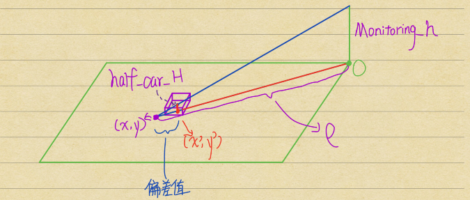
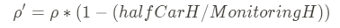

# 广州城市理工学院(华广)-ROBOMASTER人工智能挑战赛-哨岗代码-待完善版本

## 这里为往届哨岗开源的github链接，用于参考文档的编辑
[2020 中科院](https://github.com/DRL-CASIA/RMAI2020-Perception)  
[2020 哈工大](https://github.com/MengXiangBo/ICRA2020_RM_IHiter_Perception)  
[2020 西北工业](https://github.com/nwpu-v5-team/ICRA-RoboMaster-2020-Perception)  
[2020 吉大](https://github.com/Junking1/ICRA2020-JLU-TARS_GO-Perception)  
[2022 哈工大深圳](https://github.com/Critical-HIT-hitsz/RMUA2022)  
[2022 武技大(貌似)](https://github.com/chinaheyu/whistle)  

------
## 碎碎念
&emsp;&emsp;dev分支中, 开发或重构现有的代码, 测试完毕之后再merge回main分支, 使得main分支的代码不会在再次开发的过程中不断填充新的bug而变得更加臃肿和不稳定。  
&emsp;&emsp;现在主要的目的是重构暴露在外的各种hpp, 他们没有cpp, 所有的实现都写在了hpp内部, 这很不优雅.  
&emsp;&emsp;Message.hpp内部的逻辑判断为比赛前一个月匆忙编写的, 因此充满了各种暴力的实现, 极其繁多的 `if-else` , 不明所以的判断条件. 这一切都表明着开发人员在那一个月的脑内物质和这堆代码能享有一个共同的 `美誉` ---- `屎山`  
&emsp;&emsp;`v6.0` 文件夹为主哨岗代码, `副哨岗` 文件夹内容如其名字一般. 但未有文档指出这一点, 这些细节的缺失让一个项目外的人很难看懂这几个文件夹是干什么的. 其中需要提到的一个重要的信息, 主副哨岗的代码差异基本上在 `Message.hpp` 和 `yolov5main.cpp` 处.  
&emsp;&emsp;在做完一些简单的重构之后, 需要重新思考一下需要优化的各种细节, 比如 `Message.hpp` 内的逻辑判断代码能否进行类分装抽象; 各代码间的数据结构能否统一; 还有各变量名的规范(由于开发人员的脑子不清醒和项目代码经验不足, 在各处的变量起名中有 `大驼峰/小驼峰/下划线/中文拼音` 等各种类型的变量，使得代码可读性很糟糕); 编辑一个对项目的完善说明文档.  

---
# 以下为原README.md
# 哨岗
哨岗作为比赛中的定点监测单位，肩负着全局地图中实时的机器人单位监控，机器人定位分析和与己方机器人信息通讯的辅助工作。

## 检测
### 模型训练
使用开源的 [yolov5-v6.0](https://github.com/ultralytics/yolov5/tree/v6.0) 目标检测模型训练项目，投入带有机器人、装甲板和数字信息的数据集，训练出能够检测机器人和装甲板图像位置，且装甲板依据其颜色和数字判为不同类别的检测模型。
### TensorRT加速
训练出的模型可通过 TensorRT 加速推理达到更快的检测速度。经过测试，使用 `90W GTX1660ti` 显卡，在预测图片imgsz为640*640且经过 TensorRT 加速下，`yolov5s` 网络推理时间为 `4ms`，`yolov5m` 网络推理时间为 `7ms`，`yolov5l` 网络推理时间为 `14ms`，检测的效果和推理速度都符合的哨岗检测需求。
  
## 定位
### 透视变换
利用透视变换的投影映射原理，通过点击相机图像上场地的自设定四点，再把点击图像获得的四点坐标数据与预先定好的四点世界地图坐标数据一一匹配，获得透视变换矩阵。依靠得出的矩阵，可计算出当前图像上最外围场地的边框数据。  
  
将检测模型得出的机器人中心点数据与透视变换矩阵相乘运算，可获得机器人在世界地图的大致位置信息。
### 机器人颜色和编号分类
检测模型框选出的装甲板有颜色和数字的分类信息，但模型框选机器人时未分类颜色数字信息。故选取机器人矩形框偏下半部分的矩形和装甲板矩形的中心点，使用 opencv 内的 `rect.contains(cv::Point(x, y))` 方法判断装甲板中心点是否在矩形内部，从而完成机器人位置、颜色、数字编号的信息融合。  
### 偏差矫正
透视变换计算出的是贴近地面的外围矩形边框，应为机器人本身有一定高度，故而直接取模型检测出的机器人矩形框中心点计算出的世界坐标是有误差的，且随着机器人离哨岗的距离越远误差越大。  
  
如图，`MonitoringH` 为哨岗高度，`halfCarH` 为机器人半身高度，哨岗在地面的投影点为极点 `O`，`(x, y)` 为有偏差的机器人坐标点，`(x', y')` 为偏差矫正后机器人坐标点，`ρ` 为 `(x, y)` 的极径。  
`(x', y')` 可由偏差矫正后的极径 `ρ' = ρ - 偏差值` 算出，根据 `偏差值/ρ = halfCarH/MonitoringH` 和相似三角形原理，可列出总公式：  

## 传输
### ZeroMQ
信息传输方式我们使用的是 `ZeroMQ` 消息通信框架。哨岗作为 `server`，负责把全场机器人的颜色、编号和位置广播出去。机器人作为 `client`，负责获取并更新哨岗发送的信息。反复这套流程达到哨岗和机器人通信的目的。