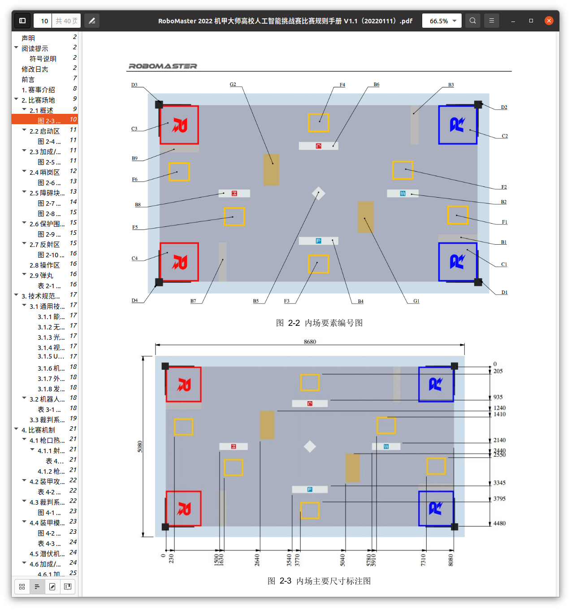
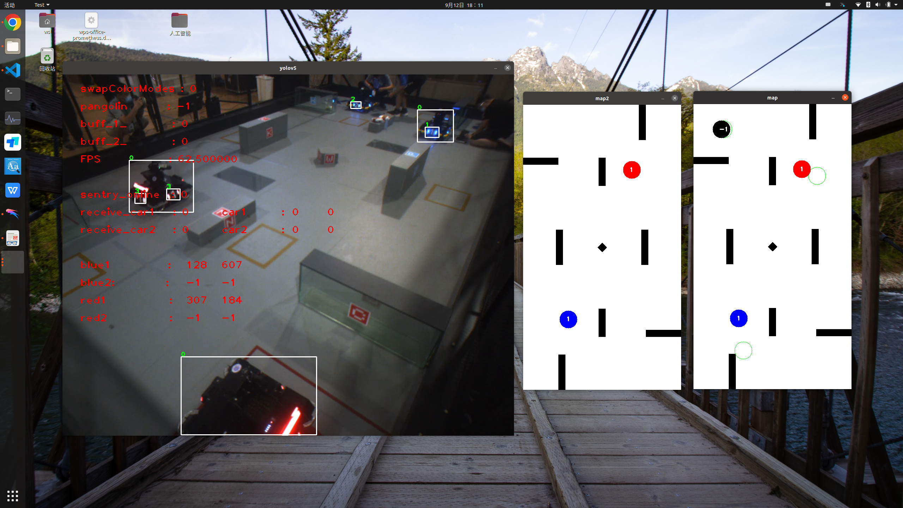

  
 

# 背景介绍
场地的四个顶点 `D1-D4` 为哨岗区. 红蓝双方各拥有对角线的两个哨岗区. 哨岗区提供了哨岗感知系统的安装接口, 参赛队伍可安装哨岗感知系统.   
`D2、D4` 为 `红方` 哨岗区域, `D1、D3` 为 `蓝方` 哨岗区域, 哨岗固定哨岗感知系统的安装高度为距离地面 `1768 mm` .
  
 

# 自定义编号内容
|  官方编号   | 自定义  |
|  ----  | ----  |
|  D1 | 蓝方主哨岗 |
|  D3 | 蓝方副哨岗 |
|  D4 | 红方主哨岗 |
|  D2 | 红方副哨岗 |
|  F1 | 死车占buff-1 |
|  F6 | 死车占buff-2 |
  
 

# 哨岗坐标转换
如图, 无论是哪个哨岗, 处理出来的车坐标数据都为同一个坐标系——以 `D4` 为原点, 短边为 `x` , 长边为 `y`.

